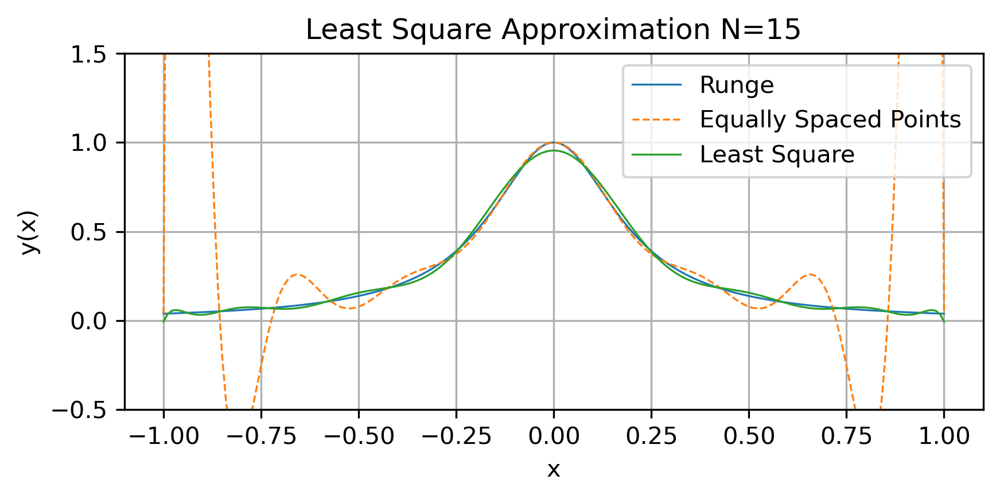
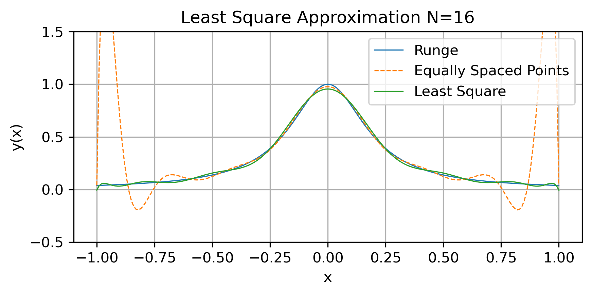
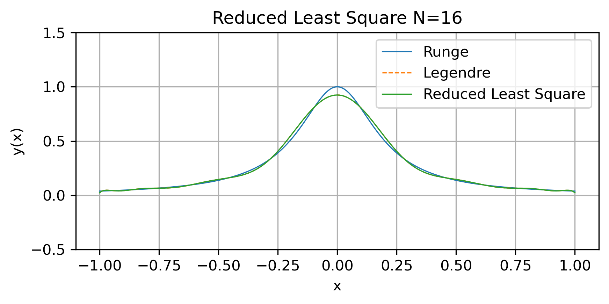
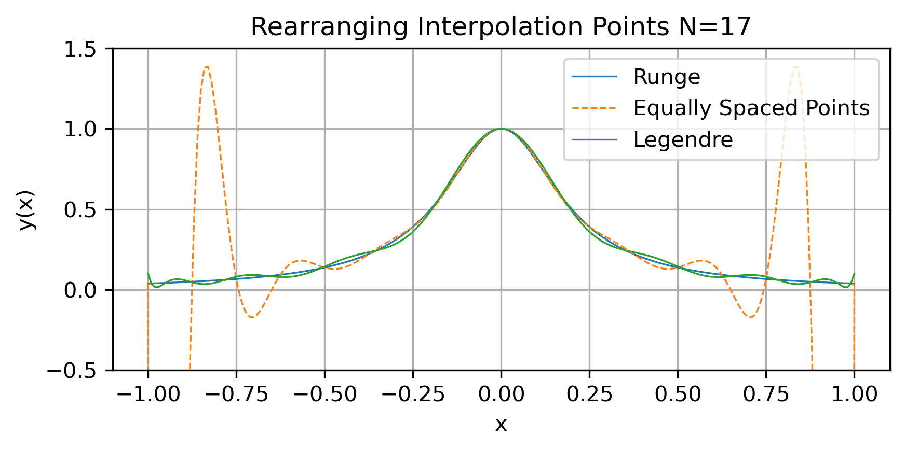
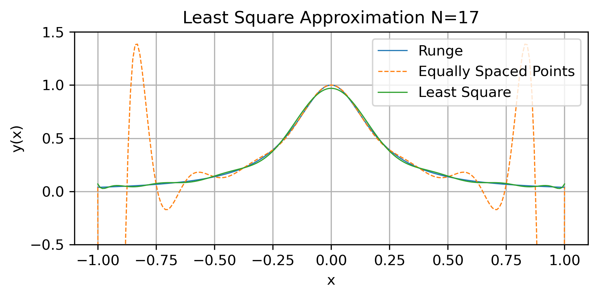
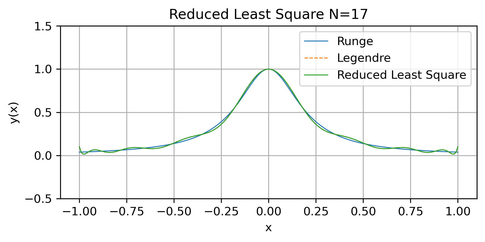
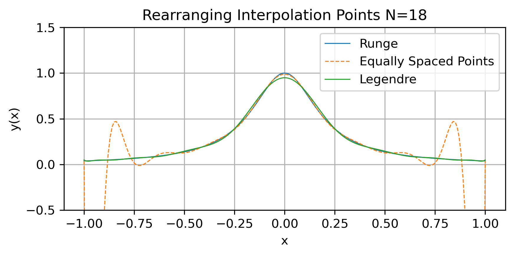
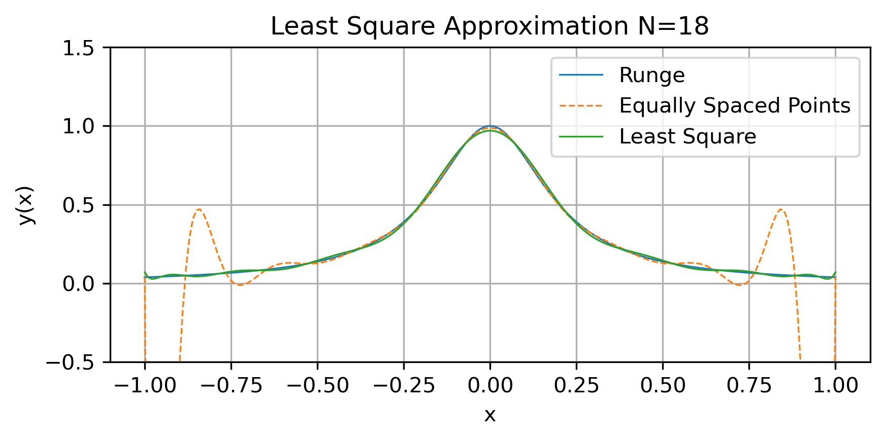
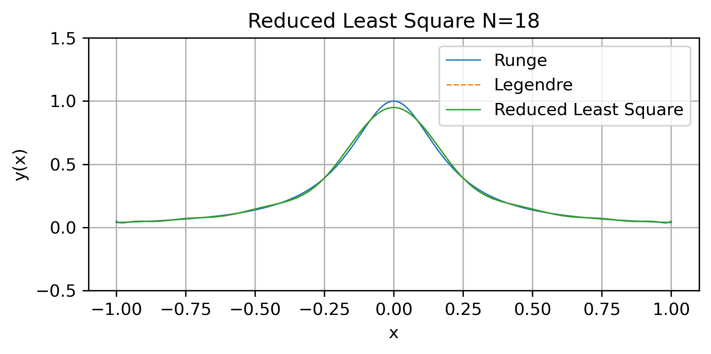

# Course Project

[TOC]

## Q.1 Solution:

### Python Code:

```python
import numpy as np
import matplotlib as matplot
def v(r):
    v=np.zeros(9)
    v[0]=10         #cm
    v[1]=9.8        #cm
    v[2]=9.6
    v[3]=9.3
    v[4]=9.06
    v[5]=8.68
    v[6]=8.18
    v[7]=7.41
    v[8]=0
    return v[r] # r的单位是cm，返回的v[r]单位是m/s
def f(r):
    rho=1.2         #kg/m^3
    y=rho*2*np.pi*r*v(int(r*100)) 
    return y
a=0
b=0.08
n=8
h=(b-a)/n
sum=0
sumeven=0
sumodd=0
for i in range(1,n):
    sum+=f(a+i*h)
InteT=h/2*(f(a)+2*sum+f(b))
for i in range (1,n):
    if i%2==0:
        sumeven+=f(a+i*h)
    else:
        sumodd+=f(a+i*h)
InterS=h/3*(f(a)+2*sumeven+4*sumodd+f(b))
print("Composite Trapezoidal Rule=",InteT,"kg/s")
print("Composite Simpson Rule=",InterS,"kg/s")

```

### Output:

Composite Trapezoidal Rule= 0.1790632414322496 kg/s
Composite Simpson Rule= 0.18621350631182 kg/s

Composite Simpson Rule is more accurate because the remainder term is $o(h^4)$ while that of the trapezoidal method is $o(h^2)$.

------

## Q.2 Solution:

$$
\left\{  

\begin{array}{**lr**}  

 k(t_{i+1})=k(t_i)+h(-\epsilon(t_i))\\

\epsilon(t_{i+1})=\epsilon(t_i)+h(-C\frac{\epsilon(t_i)^2}{k(t_i)})

\end{array}  

\right.
$$

### Python Code:

```python
import numpy as np
import matplotlib.pyplot as plt
#(a)Euler Method
a=1
b=5
N=10
h=(b-a)/N
k=np.zeros(N+1)
epsilon=np.zeros(N+1)
t=np.zeros(N+1)
#At t_0=1s, k=1.0m^2/s^2 and ϵ=0.2176m^2/s^3
k[0]=1
epsilon[0]=0.2176
t[0]=1
C=1.83
for i in range(N):
    t_ip1=a+(i+1)*h
    t[i+1]=t_ip1
    k[i+1]=k[i]+h*(-epsilon[i])
    epsilon[i+1]=epsilon[i]+h*(-C*epsilon[i]**2/k[i])
plt.figure(figsize=(8, 6), dpi=300)
plt.plot(t, k, label=f"Euler Method")
plt.plot(t, k_modi, label=f"Modified  Euler Method")
plt.plot(t, k_rk, label=f"RK4 Method")
plt.title("Solution of the ODE (K),N=10")
plt.xlabel("t")
plt.ylabel("y(t)")
plt.legend()
plt.grid()
plt.tight_layout()
plt.show()
```

### Output:

1. Results of $k$ at $t=0.5s$ ,with different number of intervals divided

   

2. Comment:

   1. RK4 Method converges the fastest following the Modified Euler Method, the Euler Method converges the slowest.
   2. RK4 Method has the best accuracy, while the Modified Euler Method and Euler Method have almost the same result.

   

## Q.3 Solution:

### Python Code:

```python
import numpy as np
import matplotlib.pyplot as plt
import math
import scipy
#(a)Bisection Method
def f(tau,y,u):
    visc=1.5e-5 #unit: m2/s 
    kappa=0.41
    B=5.1
    U_plus=u/tau
    Y_plus=tau*y/visc
    ans=-Y_plus+U_plus+np.exp(-kappa*B)*(np.exp(kappa*U_plus)-1-kappa*U_plus-1/2*(kappa*U_plus)**2-1/6*(kappa*U_plus)**3-1/24*((kappa*U_plus)**4))
    return ans
#initial guess of the interval that root is in [a,b]
a=0.1
b=2

root_bis=np.zeros(1)
root_bis[0]=(a+b)/2
y=0.01
u=21
rou=1.25
tolerance=1e-6
toler=1
i=0
while toler>=tolerance:
    i+=1
    if f(a,y,u)*f((a+b)/2,y,u)<0:
        b=(a+b)/2
    else:
        a=(a+b)/2
    toler=np.abs(b-a)
    rooti=(a+b)/2
    root_bis=np.append(root_bis,rooti)
print(root_bis)
tau_bis=root_bis[i]**2*rou
print("Wall Shear Stress(bisection method)=",tau_bis)
plt.figure(figsize=(8, 6), dpi=300)
plt.xlim([0,25])
plt.plot(list(range(len(root_bis))), root_bis, label=f"Bisection Method")
plt.title("Solution of the Non-Linear Equation")
plt.xlabel("Iteratives")
plt.ylabel("Root")
plt.legend()
plt.grid()
plt.tight_layout()
plt.show()

#(b)Newton's Method
def fd(tau,y,u): #calculate the deratives of f(tau,y,u) using differential
    dx=0.0001
    return (f(tau+dx,y,u)-f(tau,y,u))/dx
toler=1
root_n=np.zeros(1)
root_n[0]=0.1
i=0
while toler>=tolerance:
    root_np1=root_n[i]-f(root_n[i],y,u)/fd(root_n[i],y,u)
    root_n=np.append(root_n,root_np1)
    toler=np.abs(f(root_n[i+1],y,u))
    #print(toler)
    i+=1
tau_new=root_n[i]**2*rou
print('Root of u_tau=',root_np1)
print("Wall Shear Stress(Newton's method)=",tau_new)
plt.figure(figsize=(8, 6), dpi=300)
plt.plot(list(range(len(root_n))), root_n, label=f"Newton’s Method")
plt.title("Solution of the Non-Linear Equation")
plt.xlabel("Iteratives")
plt.ylabel("Root of u_tau")
plt.legend()
plt.grid()
plt.tight_layout()
plt.show()

#(c) Try to find a fixed point iteration formula that converges.
def f(U_plus):
    kappa=0.41
    B=5.1
    Y_plus=21/U_plus*0.01/1.5e-5
    ans=-Y_plus+U_plus+np.exp(-kappa*B)*(np.exp(kappa*U_plus)-1-kappa*U_plus-1/2*(kappa*U_plus)**2-1/6*(kappa*U_plus)**3-1/24*((kappa*U_plus)**4))
    return ans

toler=0.1
i=1
U_plus=np.zeros(1)
U_plus[0]=20#初始值
i=0

while toler>=tolerance:
    ans=f(U_plus[i])
    ans_1=U_plus[i]-ans/(U_plus[i]**4)
    toler=np.abs(ans_1-U_plus[i])
    #print('toler=',toler,'ans=',ans_1)
    U_plus=np.append(U_plus,ans_1)
    i+=1
    if i>1e4:
        break#控制迭代次数
tau=21/U_plus[i]
tau_wall=tau**2*rou
print("Wall Shear Stress(Fixed Point Iteration)=",tau_wall,"Iterations=",i)
print("Tolerance=",toler)

```


### Output:

1. Output of Bisection Method
   Root of u_tau= 0.9976731538772584
   Wall Shear Stress(bisection method)= 1.2441896524592446
2. Output of the Newton's Method
   Root of u_tau= 0.9976727335529737
   Wall Shear Stress(Newton's method)= 1.2441886040938286
3. Output of a fixed point iteration that converges
   Wall Shear Stress(Fixed Point Iteration)= 1.2442636648911922 
   Iterations= 4703
   Tolerance= 9.989581997160712e-07

## Q.4 Solution:

### Python Code:

```python
import numpy as np

# Define the matrix A
A = np.array([
    [52, 30, 49, 28],
    [30, 50, 8, 44],
    [49, 8, 46, 16],
    [28, 44, 16, 22]
])

def qr_eigenvalues(matrix, tol=1e-10, max_iter=1000):
    """
    Compute eigenvalues using QR decomposition.

    Parameters:
        matrix (ndarray): The input matrix.
        tol (float): Tolerance for convergence.
        max_iter (int): Maximum number of iterations.

    Returns:
        eigenvalues (ndarray): Approximate eigenvalues of the matrix.
    """
    n = matrix.shape[0]
    A_k = np.copy(matrix)
    for _ in range(max_iter):
        Q, R = np.linalg.qr(A_k)
        A_k = R @ Q
        # Check for convergence (off-diagonal elements close to zero)
        off_diagonal_norm = np.sqrt(np.sum(np.square(A_k - np.diag(np.diag(A_k)))))
        if off_diagonal_norm < tol:
            break
    return np.diag(A_k)

# Compute eigenvalues using the QR method
eigenvalues = qr_eigenvalues(A)

# Count positive and negative eigenvalues
positive_count = np.sum(eigenvalues > 0)
negative_count = np.sum(eigenvalues < 0)

print("Eigenvalues:", eigenvalues)
print("Number of positive eigenvalues:", positive_count)
print("Number of negative eigenvalues:", negative_count)

```

### Output:

Eigenvalues: [132.62787533  52.4423     -11.54113078  -3.52904455]
Number of positive eigenvalues: 2
Number of negative eigenvalues: 2

## Q.5 Solution:

### Python Code:

### Output:

## Q.6 Solution:

### Python Code:

```python
import numpy as np
import matplotlib.pyplot as plt
from dask.array import shape
from scipy.special import legendre
from scipy.integrate import quadrature
import sympy as sp
def f(x):
    return 1/(1+25*x**2)

#牛顿差商计算多项式系数，（等距点）函数
#函数输入：区间分割数，区间左右端点
def interpo_eq(N,a,b):
    num_intervals=N-1
    h=(b-a)/num_intervals
    x=np.zeros(N)
    fx=np.zeros(N)
    F=np.zeros((N,N))
    for i in range(N):
        x[i]=a+i*h
        fx[i]=f(x[i])
        F[i,0]=fx[i]
    for i in range(1,num_intervals+1):
        for j in range(1,i+1):
            num=F[i,j-1]-F[i-1,j-1]
            den=x[i]-x[i-j]
            F[i,j]=num/den
    return F,x

#牛顿差商计算多项式系数（任意点）
#函数输入：插值点
def interpo_any(x):
    N=x.shape[0]
    num_intervals=N-1
    fx=np.zeros(N)
    F=np.zeros((N,N))
    for i in range(N):
        fx[i]=f(x[i])
        F[i,0]=fx[i]
    for i in range(1,num_intervals+1):
        for j in range(1,i+1):
            num=F[i,j-1]-F[i-1,j-1]
            den=x[i]-x[i-j]
            F[i,j]=num/den
    return F

#根据牛顿差商多项式系数计算多项式值
#函数输入：差商多项式系数，插值点，需要计算的点
def inter_poly(F,z,x):
    poly=F[0,0]
    for i in range(1,F.shape[0]):
        product=1
        for j in range(0,i):
            product*=(x-z[j])
        poly+=F[i,i]*product
    return poly

#计算 N 阶 Legendre 多项式的根。
def legendre_roots(N):
    # 获取 N 阶 Legendre 多项式的系数
    P = legendre(N)
    # 使用 numpy 的多项式求根方法
    roots = P.roots
    return roots

#使用N-1次Legendre多项式对函数f(x)在[-1,1]上进行最小二乘逼近。
#使用sympy符号计算库计算积分的解析值
#函数输入：f_str (str): 目标函数的字符串形式。N: 使用的 Legendre多项式的最高阶为N-1。
#函数输出：最小二乘逼近的多项式
def legendre_least_squares(f_str, N):
    #使用符号运算求积分的解析数值
    # 定义符号变量
    x = sp.symbols('x')
    # 解析目标函数
    f = sp.sympify(f_str)
    # 计算 N-1 次的 Legendre 多项式系数和表达式
    P = [sp.legendre(i, x) for i in range(N)]
    coefficients = []
    for i in range(N):
        # 计算系数 c_i = <f, P_i> / <P_i, P_i>
        numerator = sp.integrate(f * P[i], (x, -1, 1))
        denominator = sp.integrate(P[i]**2, (x, -1, 1))
        coefficients.append(numerator / denominator)
    # 构造最小二乘多项式
    approx_poly = sum(coefficients[i] * P[i] for i in range(N))
    return sp.simplify(approx_poly)
funx = "1 / (1 + 25 * x**2)" #用字符串定义函数

# 最小二乘逼近的系数计算(高斯数值积分法)
#函数输入：N:使用的 Legendre多项式的最高阶为N-1，逼近函数f
def least_squares_coefficients(N, f):
    coefficients = []
    x, w = np.polynomial.legendre.leggauss(N)# 高斯-勒让德积分根和系数
    for n in range(N):
        Pn = legendre(n)
        def integrand(x):
            return f(x) * Pn(x)
        integral = np.sum(w * integrand(x))#高斯-勒让德积分
        coefficients.append(integral * (2 * n + 1) / 2) #乘以权重归一化
    return coefficients
# 构造逼近函数
def approximate_function(x, coefficients):
    approx = 0
    for n, c in enumerate(coefficients):
        Pn = legendre(n)
        approx += c * Pn(x)
    return approx

#绘图
plot_nump=201#绘图点
a=-1#左端点
b=1#右端点
for N in range(15,21):
    h=(b-a)/(plot_nump-1)#绘图步长
    x=np.zeros(plot_nump)#初始化x
    new_poly=np.zeros(plot_nump)
    runge=np.zeros(plot_nump)
    Lege=np.zeros(plot_nump)
    Least=np.zeros(plot_nump)
    y_approx=np.zeros(plot_nump)
    
    [F_coe,z]=interpo_eq(N,a,b)#计算插值多项式系数
    
    w=legendre_roots(N)#计算Legendre多项式根
    L=interpo_any(w)#计算Legendre多项式根的插值多项式系数
    
    approximation = legendre_least_squares(funx, N)#使用N-1次Legendre多项式最小二乘逼近
    
    coefficients = least_squares_coefficients(N, f)
    
    for i in range(plot_nump):
        x[i]=a+i*h
        new_poly[i]=inter_poly(F_coe,z,x[i])#计算插值多项式在该点的值
        Lege[i]=inter_poly(L,w,x[i])
        runge[i]=f(x[i])#计算原函数在该点的值
        Least[i]= approximation.subs(sp.symbols('x'), x[i])
        y_approx[i] = approximate_function(x[i], coefficients)
    plt.figure(figsize=(6, 3), dpi=300)
    plt.ylim([-0.5,1.5])
    plt.plot(x,runge,label=f"Runge",linewidth=0.8)
    plt.plot(x,new_poly,label=f"Equally Spaced Points",linewidth=0.8,linestyle='--')
    plt.plot(x,Lege,label=f"Legendre",linewidth=0.8)
    plt.title('Rearranging Interpolation Points N={}'.format(N))
    plt.xlabel("x")
    plt.ylabel("y(x)")
    plt.legend()
    plt.grid()
    plt.tight_layout()
    plt.show()
    
    plt.figure(figsize=(6, 3), dpi=300)
    plt.ylim([-0.5,1.5])
    plt.plot(x,runge,label=f"Runge",linewidth=0.8)
    plt.plot(x,new_poly,label=f"Equally Spaced Points",linewidth=0.8,linestyle='--')
    plt.plot(x,Least,label=f"Least Square",linewidth=0.8)
    plt.title('Least Square Approximation N={}'.format(N))
    plt.xlabel("x")
    plt.ylabel("y(x)")
    plt.legend()
    plt.grid()
    plt.tight_layout()
    plt.show()
    
    plt.figure(figsize=(6, 3), dpi=300)
    plt.ylim([-0.5,1.5])
    plt.plot(x,runge,label=f"Runge",linewidth=0.8)
    plt.plot(x,Lege,label=f"Legendre",linewidth=0.8,linestyle='--')
    plt.plot(x,y_approx,label=f"Reduced Least Square",linewidth=0.8)
    plt.title('Reduced Least Square N={}'.format(N))
    plt.xlabel("x")
    plt.ylabel("y(x)")
    plt.legend()
    plt.grid()
    plt.tight_layout()
    plt.show()
```

### Output:

| N    |                           (c)                           |                           (e)                           |                           (g)                           |
| :--- | :-----------------------------------------------------: | :-----------------------------------------------------: | :-----------------------------------------------------: |
| N=15 |  |  |  |
| N=16 |  |  |  |
| N=17 |  |  |  |
| N=18 |  |  |  |
| N=19 |  |  |  |
| N=20 |  |  |  |


